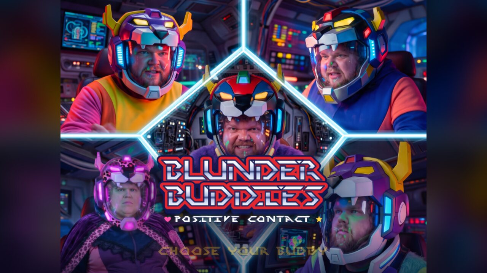
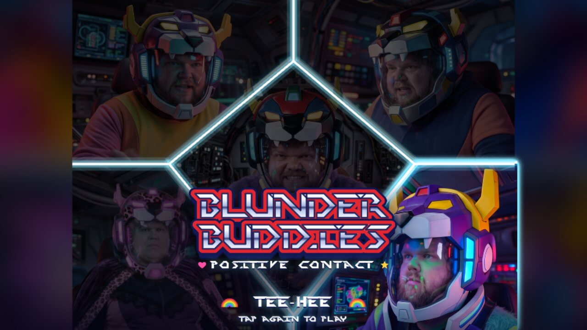
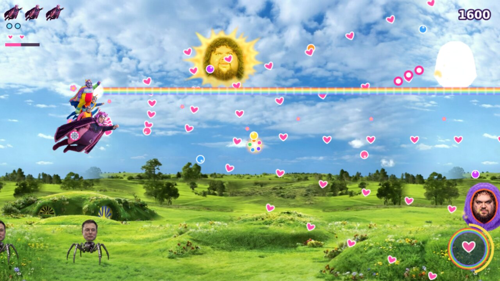
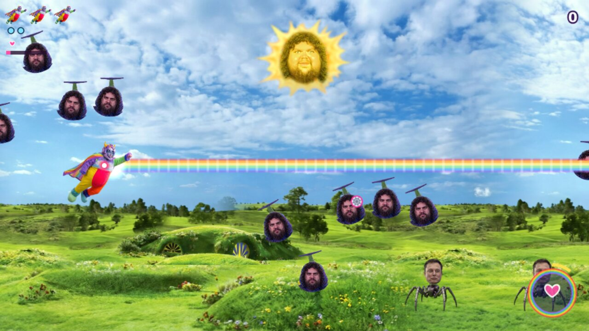
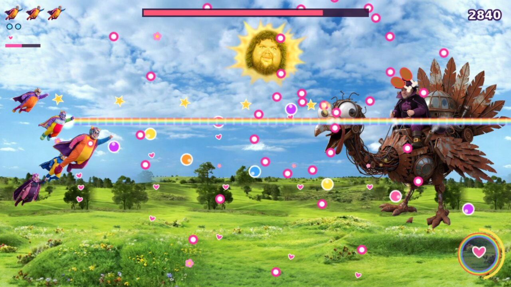
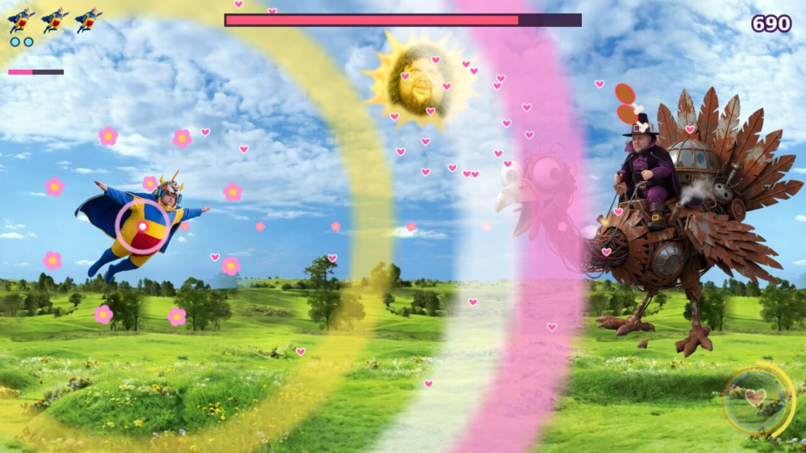

# Blunderbuddies: Positive Contact

An absurd, over-the-top side-scrolling shmup in the spirit of Cho Aniki, starring the
**Blunderbuddies** from nexusjuan's animated series. Non-commercial hobby project.

### ▶ [Play the demo](https://demo.bizarrelabs.us)

Runs in the browser on desktop and phones (hold your phone in landscape).



| | |
|---|---|
|  |  |
| **Choose your Buddy**: tap once to meet them, tap again to fly | **The team**: collect Buddies and they snake along behind you |
|  |  |
| **Happy Hills**: mimic heads in the air, Elons on the ground | **Mr. Uh-Uh-No's mecha-turkey**, with the full team |


*The Positive Vibes Wave turns every enemy bullet into a heart.*

## The Buddies

| Buddy | Attack |
|---|---|
| Nuh-Uh | Homing stars |
| Uh-Huh | Wide spread of hearts |
| Oopsie | Rubber balls that bounce off the top and bottom of the screen |
| Whoopsie-Doodle | Petals that orbit, absorb bullets, then bloom outward |
| Tee-Hee | Piercing rainbow beam |

Glowing carrier enemies drop a team pickup that adds a random Buddy as a companion. Get all five
together for **TEAM FORMED** and a free Positive Vibes Wave. The vibes meter fills as you take out
enemies and hit the boss (and slowly on its own); each full meter is another Wave, up to three.

## Controls

| | Move | Slow / show hitbox | Positive Vibes Wave |
|---|---|---|---|
| Touch | Drag anywhere (relative) | – | Heart button, bottom-right |
| Keyboard | Arrows / WASD | Shift | X or Space |
| Gamepad | Stick / D-pad | Shoulder buttons | Any face button |

Fire is automatic. On the select screen, arrows move the highlight and Enter picks.

## Run it locally

```
npm install
npm run dev
```

Open the `Local:` address it prints. The `Network:` address works on a phone on the same Wi-Fi.

**Debug flags** (add to the URL, combine with `&`): `?hero=<nuhuh|uhhuh|oopsie|whoopsie|teehee>` start as
that Buddy, `?team=N` start with N companions, `?boss` skip to the boss, `?god` no damage,
`?fps` frame counter, `?hitboxes` show collision circles.

## Build

- `npm run build`: type-check and build the web version into `dist/`
- Android: see `CLAUDE.md` (needs Android Studio / JDK 21)

Built with Phaser 4, TypeScript and Vite; Capacitor for the Android build.

## Project layout

- `src/scenes/`: title / Buddy select, level, results
- `src/entities/`: hero, companions, enemies, boss, bullets, pickups
- `src/systems/`: weapons, team formation, input, HUD, effects
- `src/data/`: tuning (Buddies, weapons, enemies, waves, boss phases, team, Wave meter, title timing)
- `public/processed/`: game-ready art and audio
- `tools/process_assets.py`: builds `public/processed/` from the original source files, which are not in this repo
- `GAME_DESIGN.md`: the design; `TODO.md`: what's left

## Credits

Characters, art, music and voices are nexusjuan's (Blunderbuddies). Title font: Perfect Dark by Brian Kent.
